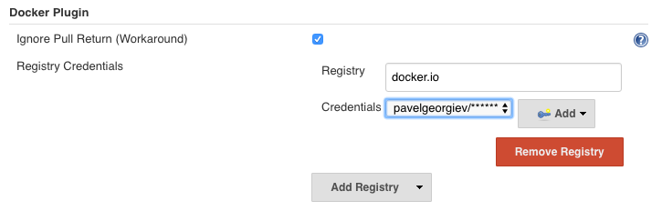
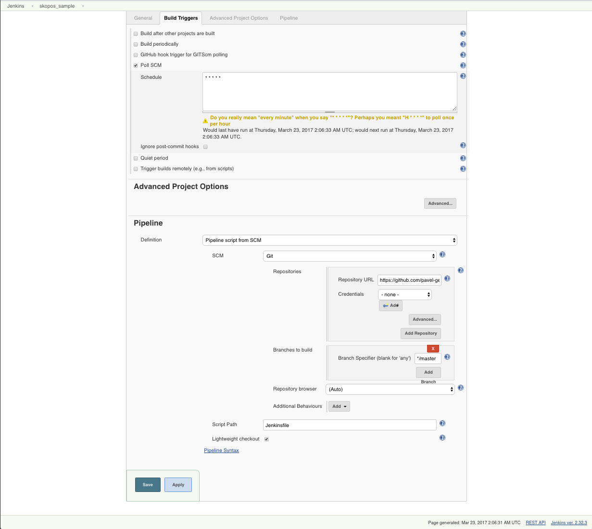
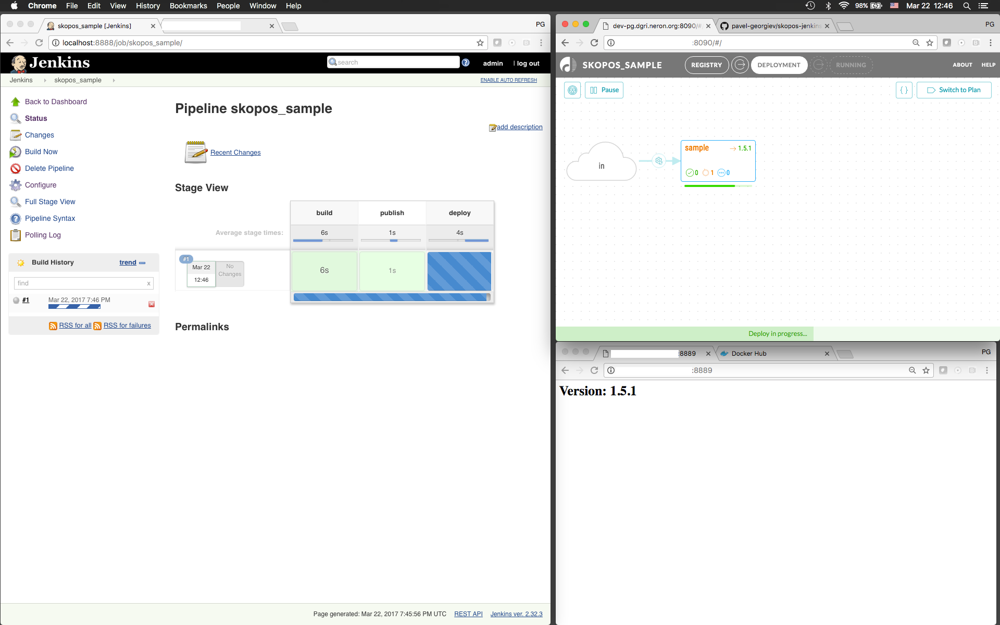

Sample Jenkins Integration for Skopos
===========================
The following document describes how to setup a CI/CD pipeline with Jenkins and Skopos. The example illustrates how code changes can be built with Jenkins and deployed with Skopos. It can be used as a baseline for creating more advanced pipelines that involve deploying in multiple stages (i.e. deploy to QA cluster, run tests, deploy to stage/production, etc).

For simplicity, the application that we will be deploying contains one service only, but the workflow below works exactly the same with complex applications.

The example uses an explicit semantic version (i.e. 1.4.8) for the service and does *not* use Skopos' auto-pilot. If you use auto-pilot, there is no need to integrate Skopos with your CI system as it will monitor for changes in your docker registry and automatically deploy new versions of the same tag when they become available (i.e. your pipeline ends with a push of an artifact to the correct docker repository and Skopos picks it up from there).


## Prerequisites
 * A docker swarm cluster (at the very least one docker server where `docker swarm init` has been run)
 * [Skopos](http://skopos-beta.datagridsys.com/README/) container running on the docker swarm (the Jenkins container needs to have network access the Skopos container)
 * [GitHub](https://github.com/) account (so that you can fork this repository, which will allow you to make changes and trigger a build/deploy)
 * Write access to a docker registry - you can sign in for a free [Docker hub](https://hub.docker.com/) account and [create a repository](https://hub.docker.com/add/repository/)


## Fork This GitHub Repo

You need your own fork in order to be able to make changes. To do so - use the 'fork' link in the upper right corner of the github page for this repository.

After doing the fork, modify the `Jenkinsfile` in your fork so that the `DOCKER_REPO` variable points to the docker repository where build artifacts will be pushed. If you are using Docker Hub, that would look like `your-dockerhub-username/sample-service`.


## Build (or Download) Jenkins Container

We start with the stock Jenkins container and install Docker, Jenkins docker plugin and Skopos CLI on top. If you prefer using a ready-made image instead of building it from scratch, you can just `docker pull datagridsys/jenkins-skopos`.

```
# Checkout your fork of this repo
git clone https://github.com/my-user/my-repo # change to actual repo
cd my-repo # change to actual dir

# Build Jenkins image
docker build -f jenkins-skopos.Dockerfile -t datagridsys/jenkins-skopos .
```


## Start Jenkins Container
Run the following command on a docker swarm manager node.

```
docker run                                         \
    -d                                             \
    --name jenkins                                 \
    --restart=unless-stopped                       \
    -p 8888:8080                                   \
    -v /var/run/docker.sock:/var/run/docker.sock   \
    --group-add=$(stat -c %g /var/run/docker.sock) \
    datagridsys/jenkins-skopos
```

## Setup Jenkins

Open Jenkins' GUI (available on port 8888) and perform the following actions:

 * Setup Jenkins account (follow instructions on the initial screen, to get initial password, run this `docker exec -ti jenkins cat /var/jenkins_home/secrets/initialAdminPassword`). When asked to install plugins, click on 'install suggested plugins'
 * Go to Jenkins -> Manage Jenkins -> Configure System -> Docker Plugin -> Add registry -> Docker Registry. Under registry type in `docker.io` (or the host of your private registry if you are not using Docker Hub). Create new credentials under credentials -> add -> Jenkins. If you are using Docker Hub for your registry, set kind to 'Username with password' and provide your username/password for Docker Hub and set the credentials ID to `sample-docker-registry-id` (you can change that, but you will need to update your Jenkinsfile later).

  * After creating the credentials, on the Jenkins configuration screen, make sure under `Docker Plugin` you have a registry with the specified host and credentials (select from the dropdown the credentials that you created above). Click Save at the bottom of the page.


## Create a New Jenkins Job

 * Go to Jenkins -> New Item, select Pipeline and give your job a name, i.e. 'skopos_sample'. Click OK.


 * On the configure screen for your new job, check Build Triggers -> Poll SCM and type `* * * * *` in the text area (this causes Jenkins to poll your git repository every minute). Under Pipeline, select Definition: Pipeline script from SCM. Select SCM -> Git and type your forked repository URL (i.e. https://github.com/my-user/my-repo) under 'Repository URL'.

Click Apply and Save at the bottom of the screen.



## Run Jenkins Job Manually

Click on 'Build Now' in Jenkins' GUI for your new job. Verify that the job completes successfully.

If it fails, check the build log. Make sure that the Skopos CLI command in the Jenkinsfile specifies the correct address where Skopos can be reached. For simplicity, this example assumes the Skopos container and Jenkins container run on the same host and that the Skopos container exposes port 8090. If you need to change that, edit the Jenkinsfile in your forked git repo and commit.


## Test Continuous Delivery

After you make sure your Jenkins job can be run manually, you can make a change in the source code of the sample application and verify that this triggers a build and deploy of the new version.

To do so:
 * Go to your forked github repository and bump the version in the `sample-service/version` file (you can do that in the web UI). Commit the change.
 * Open the Jenkins UI and Skopos' UI and verify that Skopos runs a deploy (you will see the version change to whatever you set in the step above) and that the Jenkins job succeeds. After the deploy is done and the Jenkins jobs completes, your should be able to open our sample-service (on port 8889 in our example) and see that it runs the version that you set in the previous step.




